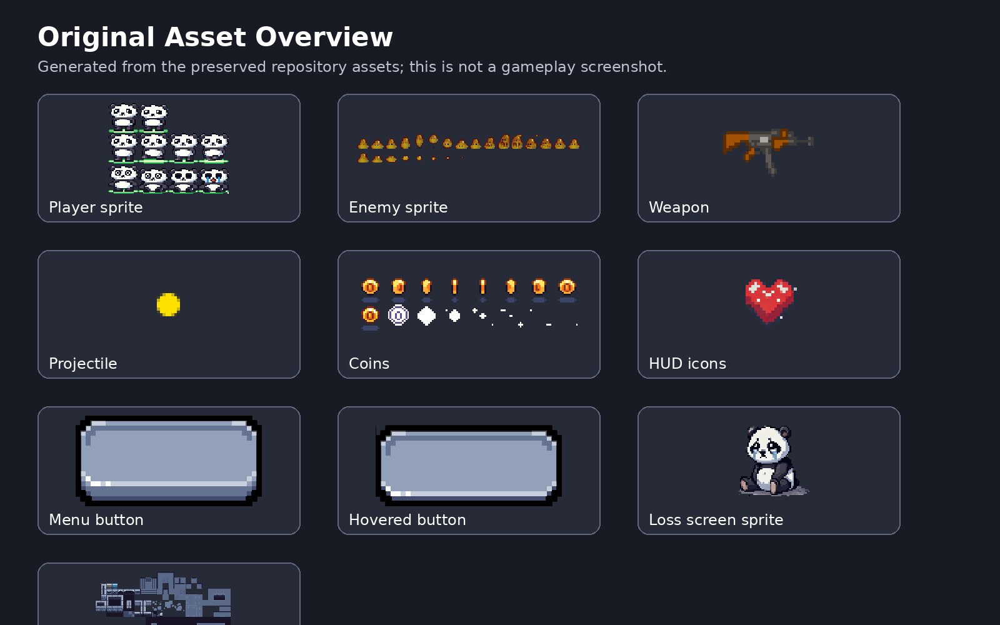
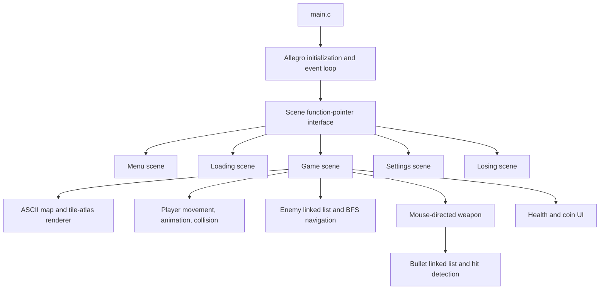

[README.md](https://github.com/user-attachments/files/30757017/README.md)
# 2D Action RPG Prototype in C with Allegro 5

A tile-based action game prototype implemented in C using the Allegro 5 multimedia library. The project combines a scene-driven game loop, animated sprites, map parsing, collision detection, enemy pathfinding, linked-list entity management, mouse-directed shooting, and audio playback in a single Visual Studio project.

> **Original-code policy:** all submitted source files, project configuration files, and assets in this repository are preserved byte-for-byte. The portfolio work consists only of this documentation, repository curation, integrity records, and Git upload configuration.



*The image above is a documentation collage generated from the preserved assets. It is not a gameplay screenshot.*

## Technical highlights

- **Scene-based architecture:** menu, loading, gameplay, settings, and losing screens share a common `Scene` interface with `init`, `update`, `draw`, and `destroy` function pointers.
- **Real-time Allegro loop:** keyboard, mouse, display, and timer events drive a 60 FPS update/draw cycle in an 800 × 800 window.
- **ASCII tile-map loading:** `Assets/map0.txt` defines a 19 × 21 level containing floors, walls, holes, coins, one player spawn, and two slime spawns.
- **Tile-atlas rendering:** map tiles are selected from a sprite atlas by examining neighboring tile types.
- **Player systems:** WASD movement, animated idle/walk/death states, four-corner collision tests, health, damage tint, and knockback.
- **Combat:** mouse aiming, click-to-fire weapon behavior, projectile movement, enemy hit detection, damage, knockback, and death animation.
- **Enemy navigation:** breadth-first search over the tile grid, followed by line-of-sight checks using a Bresenham-style traversal to smooth movement toward the player.
- **Dynamic entities:** enemies and bullets are stored in manually managed linked lists and removed during update passes.
- **Multimedia integration:** bitmap fonts, sprite animation, looping background music, and sound effects are loaded through Allegro add-ons.

## Controls

| Input | Action |
|---|---|
| `Enter` | Start the game from the menu |
| `W`, `A`, `S`, `D` | Move the player |
| Mouse movement | Aim the weapon |
| Left mouse button | Fire |
| Mouse click on menu buttons | Open settings or return to the menu |
| Window close button | Exit |

## Repository layout

```text
.
├── Assets/                     # Original images, audio, font, and map data
├── Src/                        # Original C source and header files
├── docs/
│   ├── ARCHITECTURE.md         # System-level code walkthrough
│   ├── ASSET_AND_LICENSE_NOTES.md
│   ├── PRESERVATION.md
│   ├── VERIFICATION.md
│   └── asset-overview.png
├── last_dance.vcxproj          # Original Visual Studio project
├── last_dance.vcxproj.filters  # Original Visual Studio filters
├── packages.config             # Allegro NuGet dependencies
```

## Build and run

The preserved project targets Visual Studio and uses NuGet-based Allegro dependencies.

### Requirements

- Windows 10 or 11
- Visual Studio 2022 with **Desktop development with C++**
- NuGet package restore enabled
- Allegro `5.2.10` and AllegroDeps `1.15.0`, as specified in `packages.config`

### Steps

1. Clone the repository.
2. Open `last_dance.vcxproj` in Visual Studio.
3. Restore the NuGet packages when prompted.
4. Select the `x64` configuration used by the submitted project.
5. Keep the working directory at the repository root so paths such as `Assets/panda2.png` resolve correctly.
6. Build and run the project.

The project file references the Allegro NuGet targets from a sibling `packages/` directory. Visual Studio/NuGet should create that directory during package restore.

## Architecture overview



A more detailed module-by-module walkthrough is available in [`docs/ARCHITECTURE.md`](docs/ARCHITECTURE.md).

## Current prototype boundaries

The repository preserves the submitted state, including unfinished or placeholder behavior:

- `update_map()` animates coins but does not collect them or increment the counter.
- The settings scene currently contains navigation UI but no adjustable settings.
- A losing flow is implemented, but there is no completed win condition or win scene transition.
- Several course-framework `TODO` comments remain in the source even where code has been filled in.
- Debug hitbox drawing is enabled through `DRAW_HITBOX` in `Src/utility.h`.
- The project uses hard-coded relative asset paths and is configured primarily for Visual Studio/Windows.
